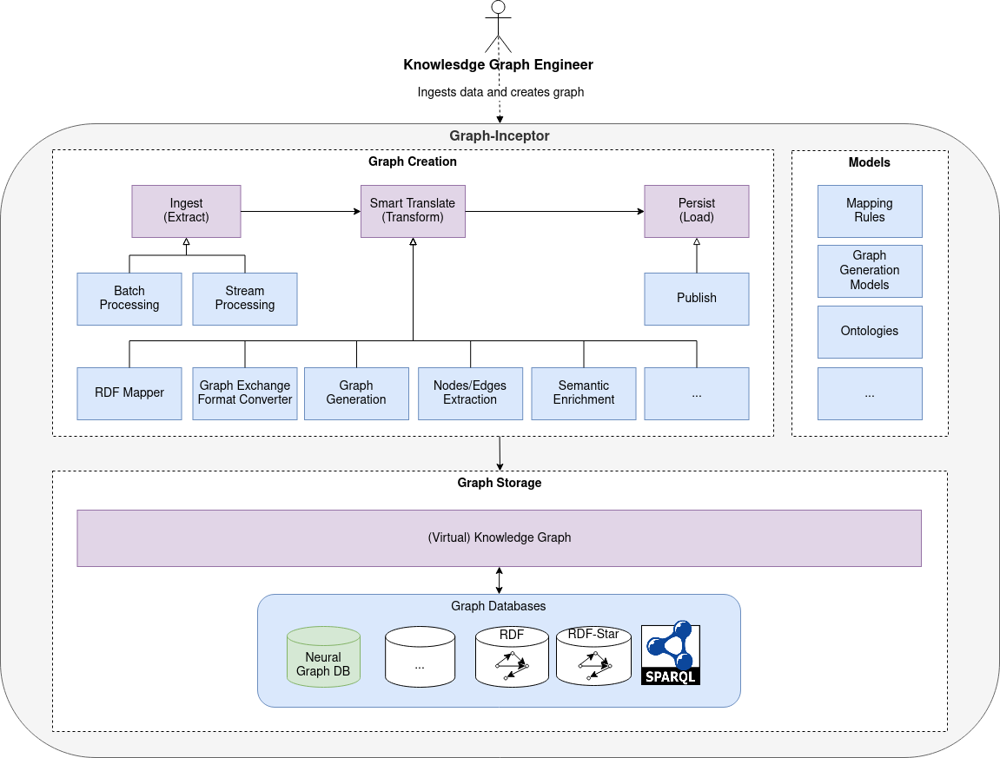

# Graph Inceptor Tool with Magma Core Library

As a reader of the introductory description of this Java library, one can conclude that most of the (development) time is spent in the compile-time universe.

To experience the meaning of this conclusion, we draw a dual to the runtime, where the operations (ops) folks are the predominant inhabitants of the universe.

The graph inceptor tool is built upon the Magma core library. Magma provides the fundamental building blocks for the creation of pipelines. A pipeline is a stream-like construct that operates on a finite amount of data. Magma's guiding philosophy is to take a "correct-by-construction" approach that leverages the fundamental nature of this universe by providing foundational, generic structures known from functional programming that allow being composed into rich types that encourage the participation of the Java Type Checker.

## Magma Repository

The Magma repository is available [here](https://github.com/DTSchroeder/gm-magma). Please note that the Magma project is still in a private repository. Thus, you have to contact [Daniel Thilo Schroeder](mailto:daniel.t.schroeder) with an email that includes your Github username. Furthermore, the entire package is still closed source. This, however, will change in the upcoming month.

## Magma Operators

Magma provides not only the pipeline abstraction but also a set of basic operators. These operators can be subdivided into three different categories.

### Intermediate Operators

Intermediate Operators lazily transform pipes (the building blocks of pipelines) into pipes.

* **Stateless Intermediate Operators**: Require only a very small amount of state to operate. They retain no state from previously seen values when processing new values. Each value can be processed independently of operations on other values.
* **Stateful Intermediate Operators**: May incorporate state from previously seen values when processing new values and require a significant amount of state, usually proportional to the number of values in a sequence.
* **Blocking Operators**: Need to process the entire input before producing output (e.g., sort in a Java stream).
* **Pipelining Operators**: Need to process the entire input before producing output.

#### Implemented Intermediate Operators:

- `Append`
- `Difference`
- `Distinct`
- `Drop`
- `Filter`
- `FlatMap`
- `Front`
- `GroupBy`
- `Insert`
- `Intersect`
- `Intersperse`
- `Join`
- `Map`
- `Peek`
- `Prepend`
- `Replace`
- `Reverse`
- `Slice`
- `Sort`
- `Tail`
- `Take`
- `Union`
- `Zip`

For comprehensive documentation on each of these operators, please refer to the Magma codebase under `magma-core/src/java/magma/compute`.

## Terminal Operators

Terminal Operators are the concluding operations in a pipeline. They either yield a result or trigger a side-effect. Activation of the terminal operation initiates the pipeline assembly phase, during which all operators within the given pipeline description are visited from bottom to top. This assembles the operators, weaving them into one another and forming the requisite contexts. The end product is an instantiated pipeline.

One way to understand this assembly is to view it as the transition from a logical to a physical execution plan. Typically, once a terminal operation is executed, the pipeline is deemed consumed and is not available for further operations. However, we provide a mechanism, depending on the pipeline type, that can flush and reset a pipeline, allowing for its reusability.

We have implemented the following terminal operators:

- Aggregate
- All
- Any
- At
- Collect
- Contains
- Convert
- Count
- Find
- First
- Fold
- ForNext
- Index0f
- Last
- Max
- Min
- None
- Reduce
- Single

# Structure of the Repository

# Notes for Gradle Build

* Is build based on [this](https://github.com/jjohannes/gradle-project-setup-howto/tree/java_module_system)
* All files ending with 'gradle.kts' are automatically detected by Gradle.
* Gradle was configured in such a way that the corresponding module files must bear the same name as the module.
* Please add you credentials to 'gradle/plugins/common/src/main/kotlin/graphma-build.publishing-conventions.gradle.kts'
* Dependencies are bundled in 'gradle/libs.versions.toml' before adding dependencies please 
  * check if the dependency is already present in the file.
  * look for an adequate bundle or create a new one.
    * if you create a new bundle make sure you only import it into the module that requires the dependencies.
* The magma library is important with the help of a local maven repository. It is important that we include this repository in the main settings.gradle.kts under dependencyResolutionManagement, and in the graphma-build.java-library-conventions.gradle.kts under repositories. Do not forget to require the module in the coresponding module-info.java and adjust the libs.versions.toml 

# Proposed Architecture for Graph Inceptor 

## Tool Tests
| Test | Validates Condition | Pass/Failure Criteria | Description |
| ---- | ------------------- | --------------------- | ----------- |
|||||
