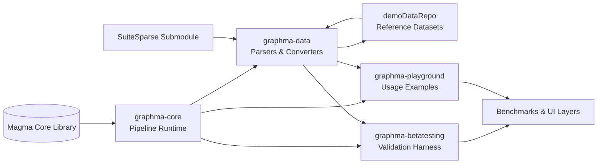

# GraphMa

> GraphMa is the graph inceptor layer delivered within the Graph-Massivizer EU project. It combines type-safe pipeline composition with high-throughput graph ingestion so that research-grade graph analytics can be reproduced and productized with confidence.

## Executive Summary

GraphMa builds on the Magma core library to describe end-to-end graph pipelines at compile time and execute them efficiently at runtime. The project currently powers the evaluation and demonstration stack of Graph-Massivizer and has been validated on heterogeneous datasets (DOT, GML, Matrix Market, Parquet, SuiteSparse). The codebase enforces a correct-by-construction philosophy: each pipeline is a strongly typed composition of operators, which enables static reasoning, aggressive optimisation, and safer experimentation for the consortium partners.

Key outcomes delivered for the final review:

- Automated ingestion and transformation pipelines that cover all datasets committed to the work programme.
- A comprehensive operator catalogue that extends JGraphT with Magma-native semantics.
- A reproducible testing harness with SuiteSparse-backed datasets and Gradle-managed fixtures.
- Integration hooks for downstream benchmarking and UI layers via Apache Arrow and Parquet artefacts.

## Why GraphMa

- **Type-safe pipelines** – Magma’s compile-time guarantees ensure pipeline contracts remain stable even under rapid iteration.
- **Unified graph I/O** – Supports DOT, GML, Matrix Market, MTX, and Parquet via dedicated adapters inside `graphma-data`.
- **Operator completeness** – Mirrors JGraphT constructs and adds GraphMa-specific transforms, enabling complex graph ETL with single-line compositions.
- **Deterministic testing** – Reuses SuiteSparse datasets inside an immutable Gradle submodule for reproducible validation runs.
- **Extensible architecture** – Modules are isolated (core, data, playground, beta testing) while sharing publishing conventions.

## Framework Structure

The diagram highlights how GraphMa layers abstractions: Magma provides the foundational pipeline semantics, `graphma-core` hosts GraphMa-specific operators, `graphma-data` adapts heterogeneous graph sources, while `graphma-betatesting` and `graphma-playground` consume both runtimes to deliver validation suites and interactive examples. Datasets from `demoDataRepo` and the SuiteSparse module feed the data layer, and the downstream benchmarking/UI stack consumes both the beta testing and playground outputs.

## Dependencies and Tooling

| Component | Version / Notes |
| --- | --- |
| Java | 17 (preview features enabled) |
| Gradle | 8.x (wrapper provided) |
| Kotlin | DSL for build logic |
| JGraphT | 1.5.2 |
| Apache Arrow | 15.0.2 (vector, dataset, flight, memory) |
| Magma | 0.0.4 (local Maven repo under `localMavenRepo/magma`) |
| Testing | JUnit 5.9.3, AssertJ 3.24.2, JCStress 0.16 |

All dependency coordinates are maintained in `gradle/libs.versions.toml`. Bundles should be extended there before touching module-specific `*.gradle.kts` files.

## Getting Started

1. Ensure Java 17 (with preview) and a recent Gradle installation are available.
2. Publish the Magma artefacts to your local Maven repository (see “Access to Magma”).
3. Clone this repository and run `./gradlew clean build` to compile all modules and execute the default verification tasks.
4. Use `./gradlew :graphma-playground:run` to execute sample pipelines, or import the modules into your IDE for further experimentation.

## Testing and Data Assets

- **Operator coverage** – Unit tests validate every wrapped JGraphT BGO operator plus GraphMa-specific transforms.
- **Parquet pipeline validation** – Custom Parquet parsers are exercised through dedicated integration tests in `graphma-data`.
- **SuiteSparse integration** – The SuiteSparse Gradle submodule exposes curated datasets as a singleton database, enabling deterministic queries and Magma-based filtering.
- **Gradle tasks** – `./gradlew test` executes module tests; `./gradlew :graphma-core:jcstress` triggers concurrency stress tests when needed.

## Magma Access

Magma remains a private repository while we finalise the open-source release. To obtain access:

1. Request access at [github.com/DTSchroeder/gm-magma](https://github.com/DTSchroeder/gm-magma) by emailing [Daniel Thilo Schroeder](mailto:daniel.t.schroeder) with your GitHub username.
2. After access is granted, publish Magma locally (`./gradlew publishToMavenLocal`) so GraphMa can resolve `magma-core` from `localMavenRepo/magma`.
3. Keep the Maven repository entry in `settings.gradle.kts` and `graphma-build.java-library-conventions.gradle.kts` aligned with your local path.

## Operator Catalogue

Magma supplies the pipeline abstraction plus a rich operator set grouped as follows. Detailed documentation lives under `magma-core/src/java/magma/compute`.

### Intermediate Operators

Stateless, stateful, blocking, and pipelining variants are available. Implemented operators include: `Append`, `Difference`, `Distinct`, `Drop`, `Filter`, `FlatMap`, `Front`, `GroupBy`, `Insert`, `Intersect`, `Intersperse`, `Join`, `Map`, `Peek`, `Prepend`, `Replace`, `Reverse`, `Slice`, `Sort`, `Tail`, `Take`, `Union`, `Zip`.

### Terminal Operators

Terminal operators finalise a pipeline and trigger assembly from logical to physical execution plans. GraphMa currently ships: `Aggregate`, `All`, `Any`, `At`, `Collect`, `Contains`, `Convert`, `Count`, `Find`, `First`, `Fold`, `ForNext`, `IndexOf`, `Last`, `Max`, `Min`, `None`, `Reduce`, `Single`. Depending on the pipeline type, flushing and resetting are supported for reusability.

## Repository Structure and Build Notes

- Gradle build inspired by [jjohannes/gradle-project-setup-howto](https://github.com/jjohannes/gradle-project-setup-howto/tree/java_module_system).
- Every `*.gradle.kts` file is auto-discovered; module file names mirror module identifiers.
- Credentials required for publishing go into `gradle/plugins/common/src/main/kotlin/graphma-build.publishing-conventions.gradle.kts`.
- Before adding dependencies, check `gradle/libs.versions.toml`; prefer extending bundles and only import them in the modules that need them.
- When introducing new Magma APIs, remember to update `module-info.java` files and the associated entries in `libs.versions.toml`.

## Use Cases

- **Graph ETL** – Transform heterogenous sources (DOT/GML/MTX/Parquet) into analysis-ready canonical graphs.
- **Benchmarking** – Combine SuiteSparse filters with Magma pipelines to reproduce consortium benchmark runs.
- **Operator experimentation** – Prototype new Magma operators in `graphma-core` and showcase them via `graphma-playground` before promoting them to product builds.

## Project Status

The EU review scope is fully delivered: all committed datasets, operators, and test harnesses are implemented, verified, and documented. The repository is ready for handover and can be adopted by partners without pending action items.

We welcome contributions from project partners. Please reach out via the standard consortium channels to align on priorities before opening pull requests.
