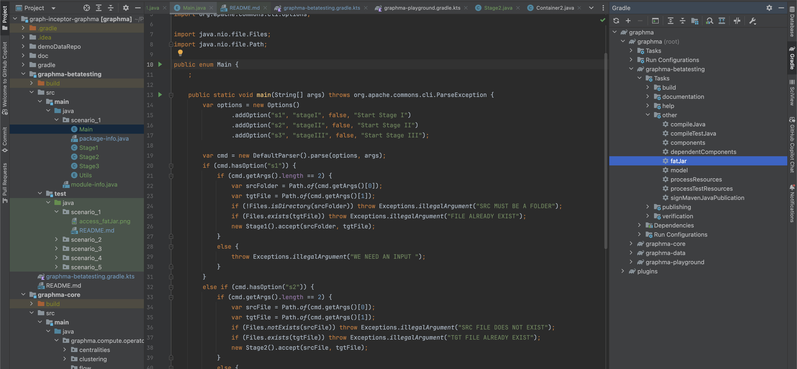
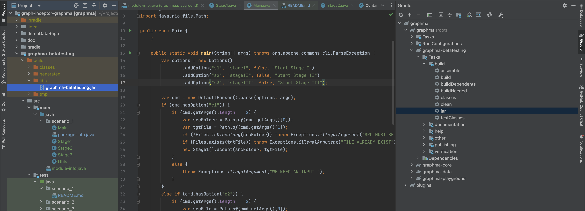

# Scenario 1: Use GraphMa Library (Precompiled) and Run Predefined Graph Pipelines

This scenario describes the process of using a precompiled GraphMa library to execute a set of graph processing stages. 
Each stage is triggered using specific command line instructions. 

- Prototyping with JGraphT: We utilize JGraphT for prototyping stages within our pipelines. The intention is to eventually replace these prototypes with highly optimized GraphMa operators to enhance performance.
- Limited Use of Full Functionality: The current use case does not exploit the full capabilities of the GraphMa library. The source code provided for this scenario, particularly in the scenario_1 package, is meant for initial testing purposes only and should not be considered a representation of the complete functionality of GraphMa.
  - Full Utilization of GraphMa: All subsequent scenarios after Scenario 1 will exclusively use GraphMa's features and components. These scenarios are designed to thoroughly test the library in various configurations and use cases.
- Subdivided Pipeline: This scenario simulates a pipeline that is subdivided, potentially operating across different containers, mimicking a distributed environment where parts of the pipeline can be executed independently in separate computational units.

## Prerequisites
- Java Runtime Environment (JRE) or Java Development Kit (JDK) installed.
- Checked out the betatesting branch in Intellj
- Download the required test data from the provided link.

## Test Data
Download the test data necessary for this scenario [here](https://drive.google.com/drive/folders/1d2F46u37vPdjW5LPVClNy4DZM9oUpPSr?usp=sharing).

## Graph Processing Stages
Below are the stages included in this scenario, along with the commands to execute each stage. 
Each stage uses the `graphma-betatesting.jar`, which should be compiled as per the instructions in the following images.





### Stage 1: Merge Input Files
Merge multiple input files into a single CSV file.
```bash
# MERGE INPUT FILES
java -jar graphma-betatesting.jar -s1 PATH_TO_INPUT_FOLDER/input PATH_TO_RESULT_FOLDER/intermediate.csv
```

### Stage 2: Transform to GraphMl output format
```bash
# TRANSFORM CSV TO GRAPHML
java -jar graphma-betatesting.jar -s2 PATH_TO_RESULT_FOLDER/intermediate.csv PATH_TO_RESULT_FOLDER/intermediate.graphml
```

### Stage 2: Find cluster using label propagation
```bash
# PERFORM LABEL PROPAGATION CLUSTERING
java -jar graphma-betatesting.jar -s3 PATH_TO_RESULT_FOLDER/intermediate.graphml
```

